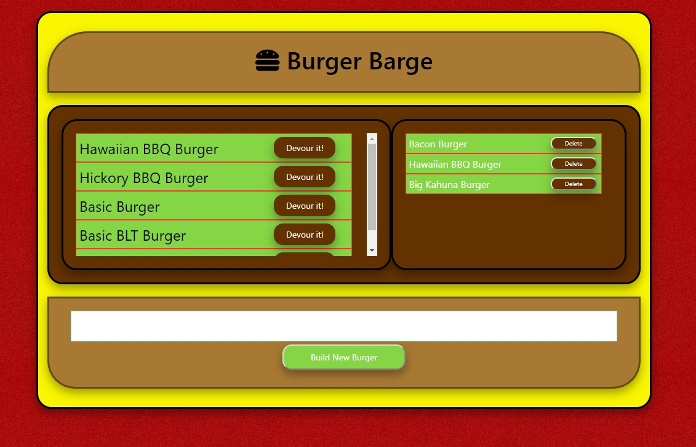

# 12_Burger_2

### Table of Contents
- [Description](#Description)
- [Technologies-Libraries](#Technologies-Libraries)
- [Screenshots](#Screenshots)
- [Link](#Link)
​
### Description
This assignment is a build upon the previous assignment. In this version we replaced our own orm with Sequelize. I also chose to update the look to look like a burger for a little fun.

We using SQL as a database and we are using Sequelize to pass the data into the database. The process is to create a new Burger which creates an entry in the database and returns that entry back to the page using handlebars to render. Once on the page it shows up in a list of burgers. There is an option to devour the burger which will then move that burger to the devoured list on the right. This is setting a boolean value in the database for that item, devoured will now be true. From there the burger can be deleted, this will delete the entry from the database.

### Technologies-Libraries
- [NodeJS](https://nodejs.dev/) - Server side code
- [inquirer](https://www.npmjs.com/search?q=inquirer) - User inputs on the command line
- [mysql](https://www.mysql.com/) - MySQL DB
- [handlbars](http://handlebarsjs.com/) - Handlebars template
​
### Screenshots
​

​
### Link
Check it out! 

https://pacific-reef-67221.herokuapp.com/

https://github.com/chrisneal72/11_Node_Express_Handlebars
